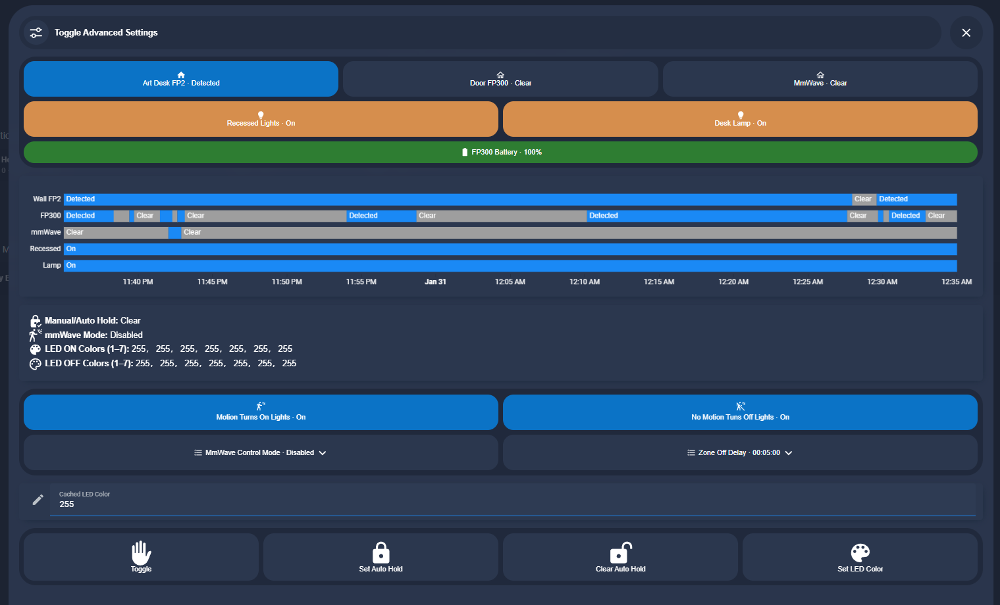
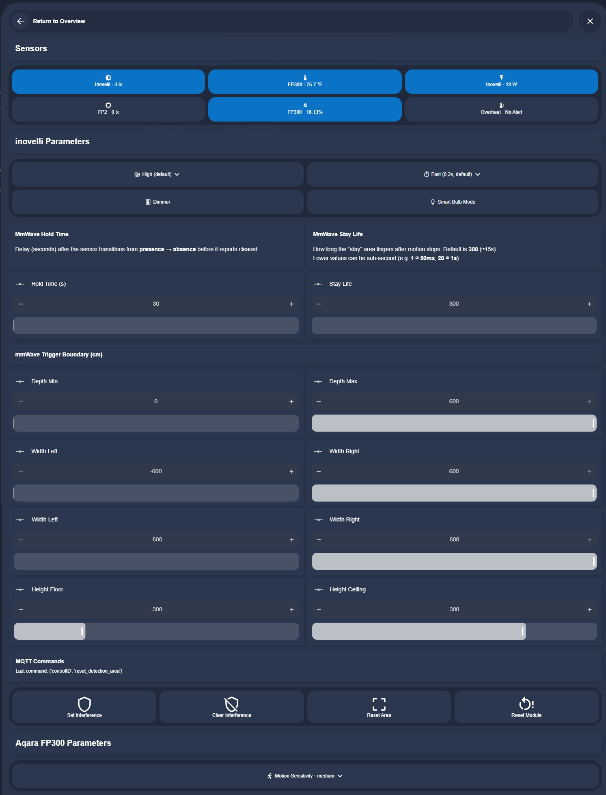

# Occupancy-Based Lighting

Automatic, zone-aware lighting driven by mmWave presence sensors and Inovelli smart switches.

## Overview

Every room in the house has occupancy-based lighting controlled by a combination of:

- **Inovelli Blue Series 2-in-1 switches** — smart dimmers with built-in mmWave presence detection
- **Zooz ZEN32 scene controllers** — 5-button scene controllers for manual overrides
- **Zooz ZEN37 remotes** — wall-mounted remotes for secondary control points

When presence is detected, lights turn on automatically. When the room is vacated, lights turn off after a configurable delay. The system supports interference zones, hold states, and per-room tuning.

<!-- TODO: Add photo of Inovelli switch installed -->

## Dashboard controls

Each zone has a popup card for monitoring and tuning:

### Quick controls

The home view shows sensor status, current lighting state, and quick toggles for hold and interference modes.

### Advanced settings

The advanced view exposes per-zone timing, sensitivity, and sensor configuration — useful for dialing in a new zone.

## How it works

This feature is implemented entirely in **HA YAML** — no AppDaemon needed. The core components:

- **Blueprints** — reusable templates for switch behavior (Inovelli, ZEN32, ZEN37)
- **Automations** — per-zone occupancy logic, button mappings, hold/interference handling
- **Scripts** — Inovelli LED notification scripts, zone preset scripts
- **Helpers** — `input_boolean` for hold states, `input_select` for zone presets

## Home Assistant YAML

| Area | Path |
|------|------|
| Occupancy automations | `home-assistant/automations/occupancy-based-lighting/` |
| Button mappings | `home-assistant/automations/switch-buttons/` |
| Inovelli scripts | `home-assistant/scripts/inovelli/` |
| Zone presets | `home-assistant/scripts/zone-presets/` |
| Blueprints | `home-assistant/blueprints/` |
| Dashboard cards | `home-assistant/cards/` (per-floor subdirectories) |

## Zones

<!-- TODO: List all configured zones with their switches and sensors -->

The system covers rooms across all floors:

- **Basement** — rumpus room, movie room, hallway, staircase, bathroom, concessions, server room
- **Downstairs** — entrance, mudroom, bathroom
- **Upstairs** — primary bedroom, primary bathroom, primary closet, primary hall, laundry, kids bathroom
- **Garage** — interior mudroom, doors

## Devices

| Device | Role | Rooms |
|--------|------|-------|
| Inovelli Blue 2-in-1 | Dimmer + mmWave presence | Most rooms |
| Zooz ZEN32 | 5-button scene controller | Select rooms for multi-zone control |
| Zooz ZEN37 | 4-button wall remote | Secondary control points |

<!-- TODO: Add device photos from docs/img/ -->
